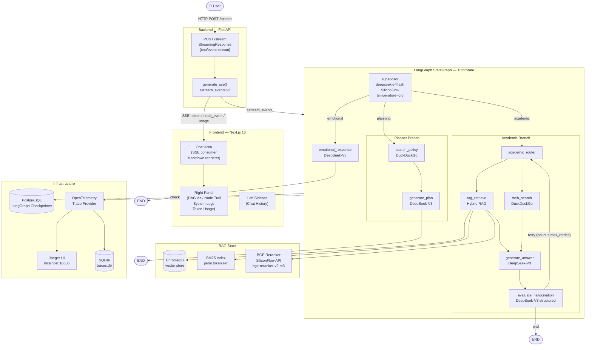
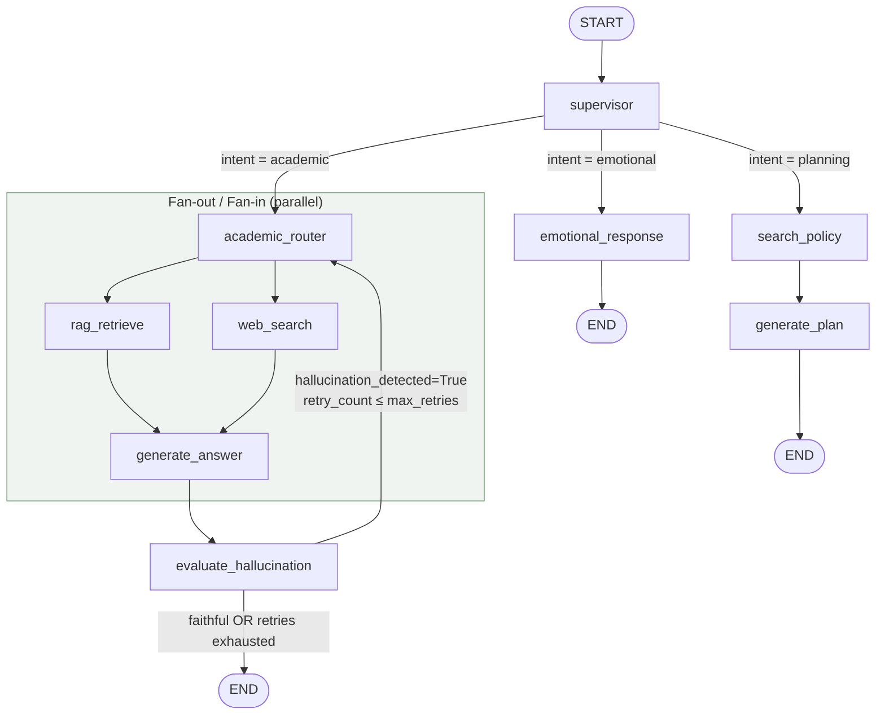
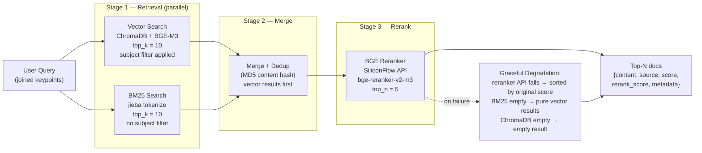
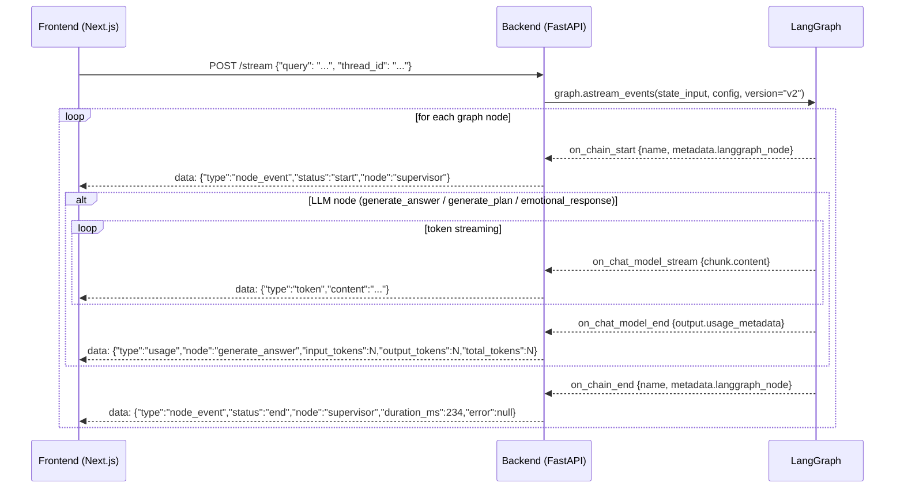
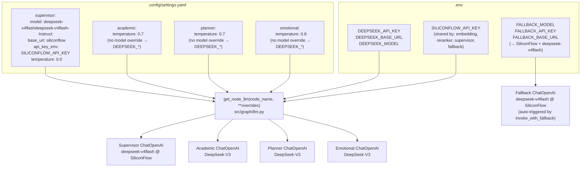

# v0.2.0 架构图

本文档包含 v0.2.0 系统架构的 Mermaid 图解。Mermaid 节点标签及代码片段保留英文，以便与代码库保持一致。

---

## 1. 全系统架构总览



---

## 2. LangGraph 节点拓扑（状态流转）



**`TutorState` 关键字段与写入方归属：**

| 字段 | 写入方 | 消费方 |
|------|--------|--------|
| `messages` | supervisor（初始化）、generate_answer、generate_plan、emotional_response | 所有节点 |
| `intent` | supervisor | builder（条件边） |
| `subject` | supervisor | rag_retrieve（元数据过滤） |
| `keypoints` | supervisor | rag_retrieve（查询构造） |
| `context` | rag_retrieve、web_search（通过 `operator.add` 合并） | generate_answer |
| `search_results` | search_policy | generate_plan |
| `retry_count` | evaluate_hallucination | should_retry_or_end |
| `hallucination_detected` | evaluate_hallucination | should_retry_or_end |

---

## 3. 混合 RAG 流水线



**`config/settings.yaml` 配置参数说明：**

```yaml
rag:
  vector_top_k: 10
  bm25_top_k: 10
  reranker_top_n: 5
  relevance_threshold: 0.3
  reranker_model: "BAAI/bge-reranker-v2-m3"
```

---

## 4. SSE 事件流格式规范



**前端 SSE 事件消费映射：**

| SSE 事件 | 前端处理逻辑 |
|----------|------------|
| `node_event` start | `nodeEvents` 状态：追加 `{node, status: "running", ts}` |
| `node_event` end | `nodeEvents`：标记 `status: "done"`，附加 `durationMs`；向日志追加 `[PERF]` 条目 |
| `node_event` end with error | `nodeEvents`：标记完成；向日志追加 `[ERROR]` 条目 |
| `token` | 将 `content` 追加到当前助手消息（流式打字机效果） |
| `usage` | 累加到 `tokenUsage` 状态；向日志追加 `[USAGE]` 条目 |

---

## 5. LLM 配置架构



