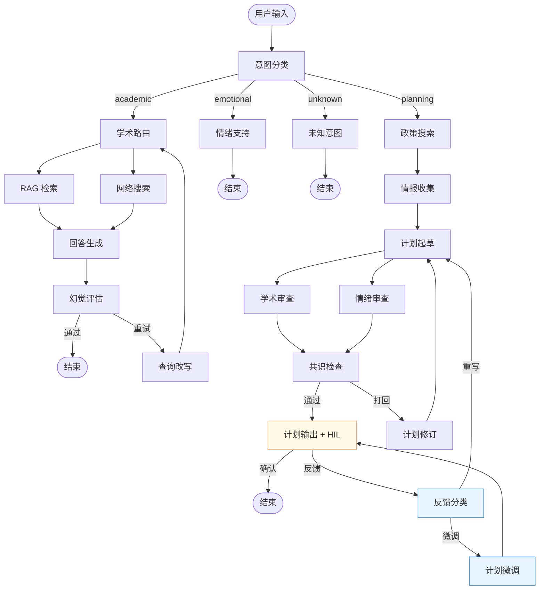
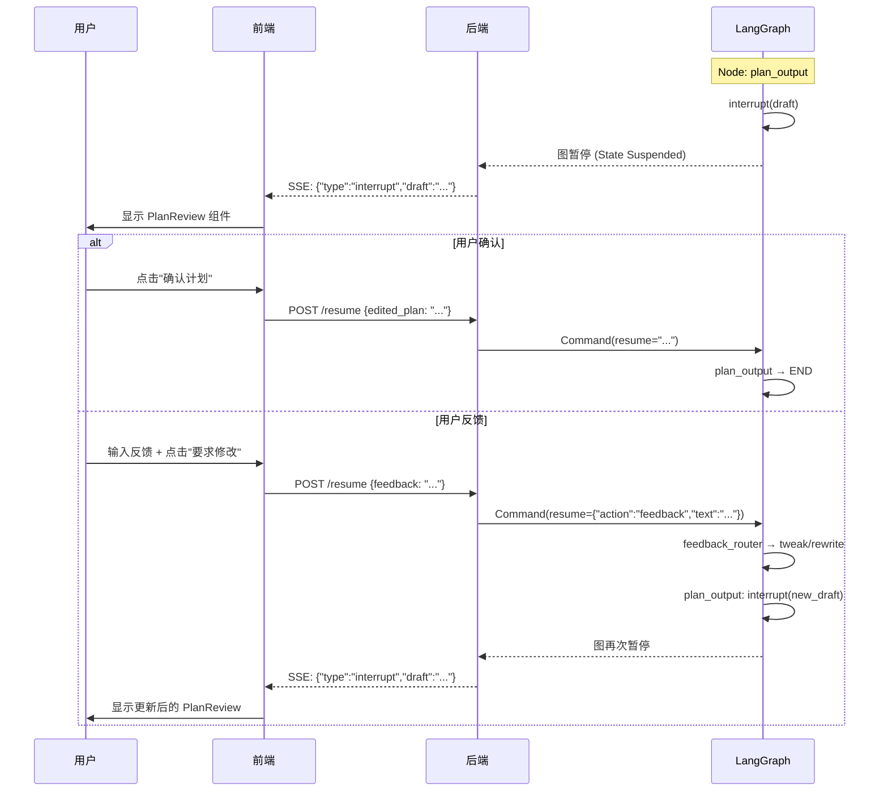

# v0.3.0 架构图

## A.架构图

```mermaid
graph TD
  START([用户输入]) --> supervisor[意图分类]

  supervisor -->|academic| academic_router[学术路由]
  supervisor -->|planning| search_policy[政策搜索]
  supervisor -->|emotional| emotional_response[情绪支持]
  supervisor -->|unknown| handle_unknown[未知意图]

  %% Academic branch
  academic_router --> rag_retrieve[RAG 检索]
  academic_router --> web_search[网络搜索]
  rag_retrieve --> generate_answer[回答生成]
  web_search --> generate_answer
  generate_answer --> evaluate_hallucination[幻觉评估]
  evaluate_hallucination -->|通过| END_A([结束])
  evaluate_hallucination -->|重试| rewrite_query[查询改写]
  rewrite_query --> academic_router

  %% Planning branch
  search_policy --> gather_intel[情报收集]
  gather_intel --> drafter[计划起草]
  drafter --> reviewer_academic[学术审查]
  drafter --> reviewer_emotional[情绪审查]
  reviewer_academic --> consensus_check[共识检查]
  reviewer_emotional --> consensus_check
  consensus_check -->|通过| plan_output[计划输出 + HIL]
  consensus_check -->|打回| adv_rewrite[计划修订]
  adv_rewrite --> drafter

  %% HIL feedback loop
  plan_output -->|确认| END_P([结束])
  plan_output -->|反馈| feedback_router[反馈分类]
  feedback_router -->|微调| plan_tweak[计划微调]
  feedback_router -->|重写| drafter
  plan_tweak --> plan_output

  %% Terminal nodes
  emotional_response --> END_E([结束])
  handle_unknown --> END_U([结束])

  %% Styling
  style plan_output fill:#FFF9E6,stroke:#E8A87C
  style feedback_router fill:#E8F4FD,stroke:#4A90D9
  style plan_tweak fill:#E8F4FD,stroke:#4A90D9
```

## B.顺序图

```mermaid

sequenceDiagram
  participant U as 用户
  participant FE as 前端
  participant BE as 后端
  participant G as LangGraph

  Note over G: Node: plan_output
  G->>G: interrupt(draft)
  G-->>BE: 图暂停 (State Suspended)
  BE-->>FE: SSE: {"type":"interrupt","draft":"..."}
  FE->>U: 显示 PlanReview 组件

  alt 用户确认
      U->>FE: 点击"确认计划"
      FE->>BE: POST /resume {edited_plan: "..."}
      BE->>G: Command(resume="...")
      G->>G: plan_output → END
  else 用户反馈
      U->>FE: 输入反馈 + 点击"要求修改"
      FE->>BE: POST /resume {feedback: "..."}
      BE->>G: Command(resume={"action":"feedback","text":"..."})
      G->>G: feedback_router → tweak/rewrite
      G->>G: plan_output: interrupt(new_draft)
      G-->>BE: 图再次暂停
      BE-->>FE: SSE: {"type":"interrupt","draft":"..."}
      FE->>U: 显示更新后的 PlanReview
  end
  
```

